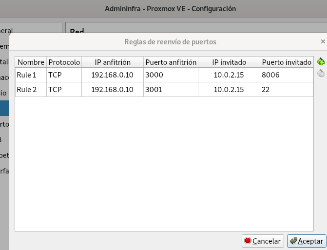
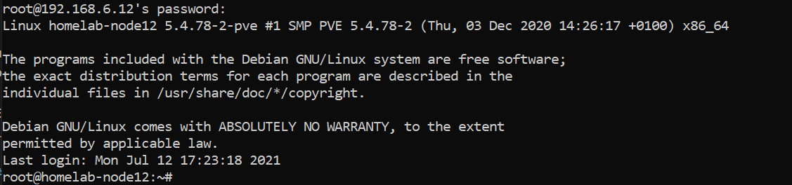
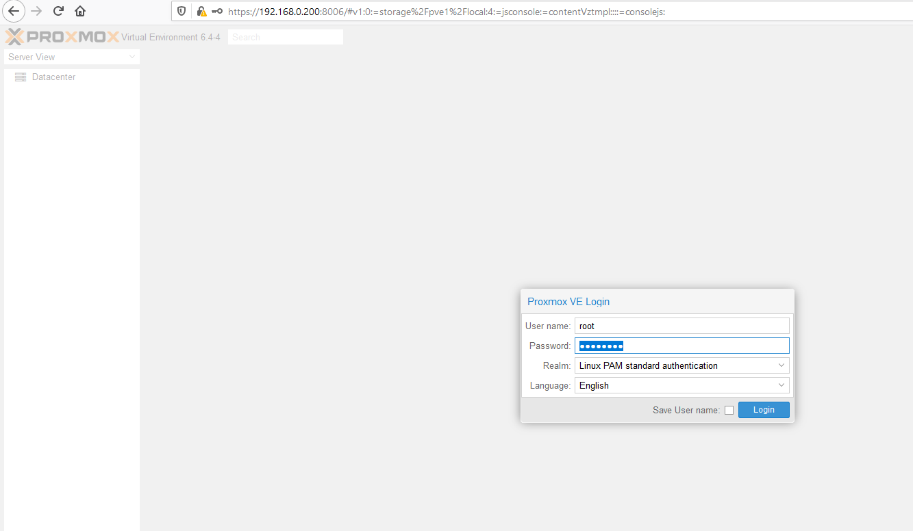
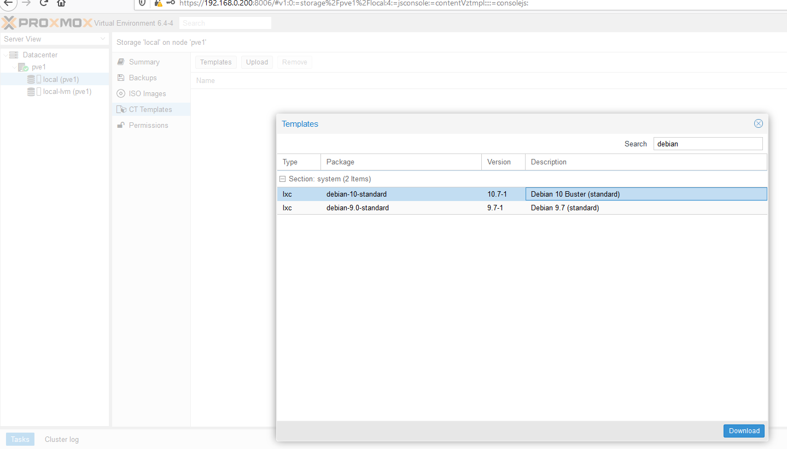
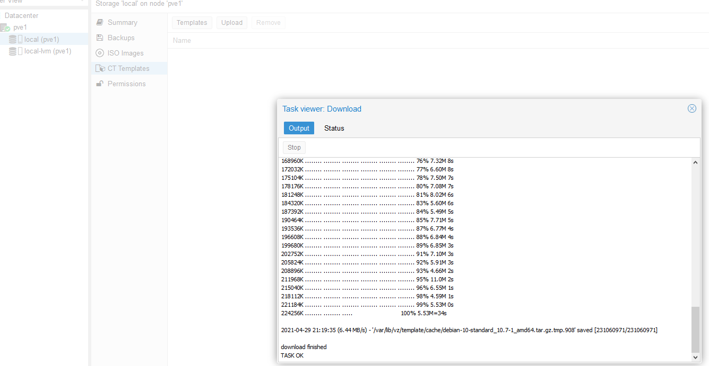
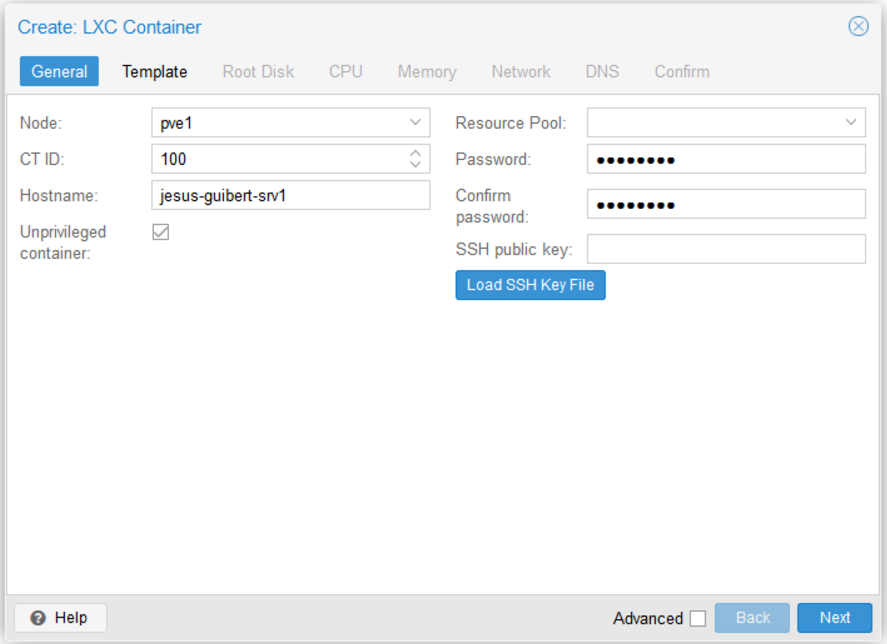
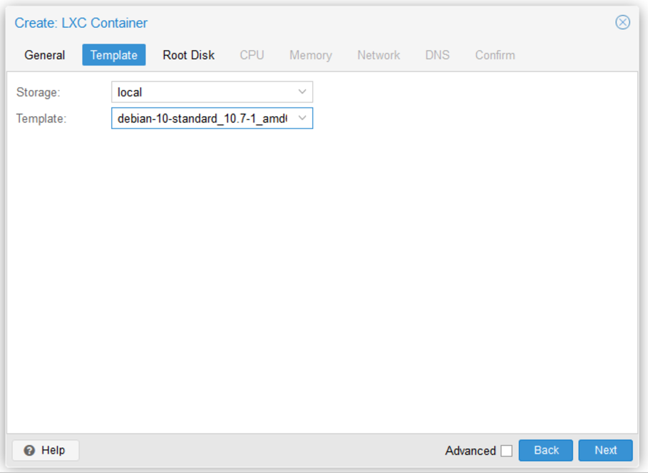
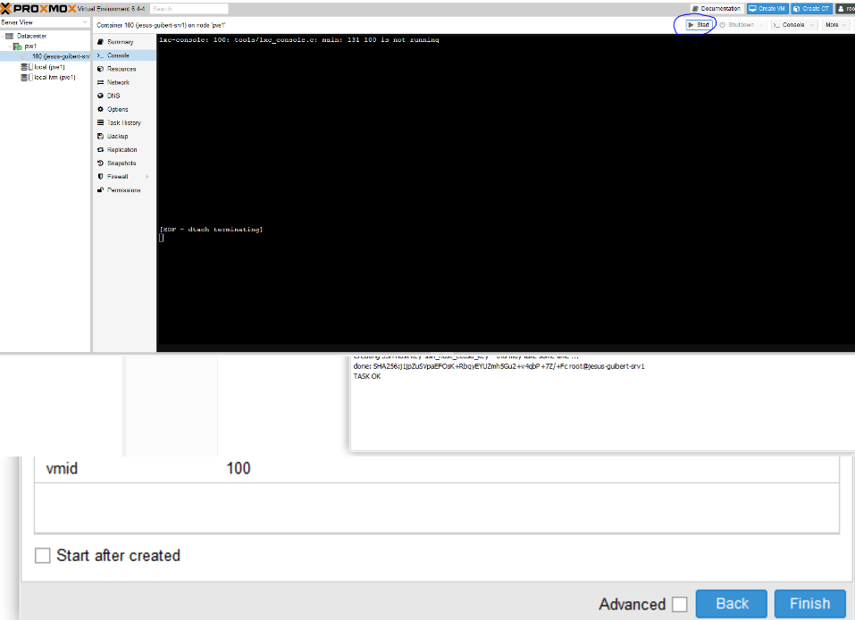
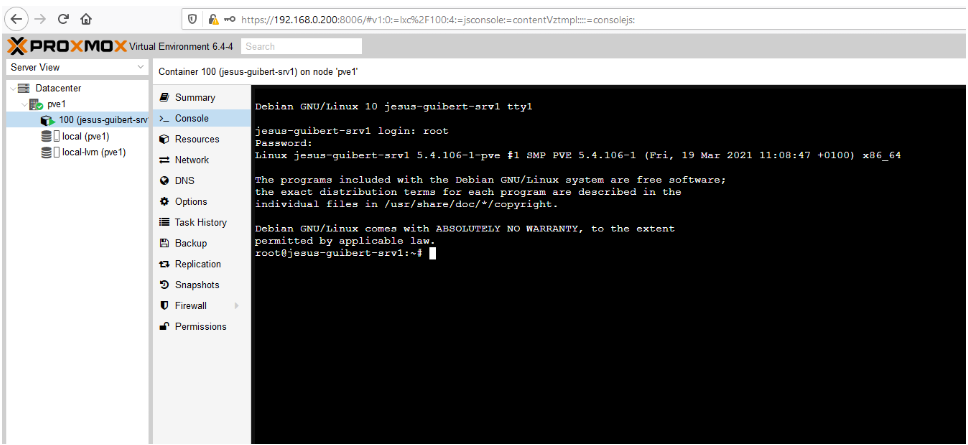

# Taller 1 - Mi primer contenedor en Proxmox VE

## Descripción

Finalizado el proceso de instalación de Proxmox VE 7 en nuestra maquina virtual, el siguiente paso es configurar el PortForwarding para que desde nuestro sistema operativo Host (el instalado fisicamente en nuestro equipo) podramos acceder mediante ***SSH*** y mediante el ***Dashboard de Proxmox***. 

> ¿Porque PortForwarding? Si utilizaramos el tipo de red (bridge), la vm se conectaría directamente a nuestra LAN y se le podria asignar una dirección IP dentro de ese rango, ya sea mediante ***dhcp*** (otorgada por un servidor dhcp) o estatica (configurada de manera manual). EN CAMBIO AL UTILIZAR EL TIPO ***NAT***, el direcciónamiento es gestionado por un servicio especifico del hipervisor. Implementando su propia información de red.

Estos servicios se encuentran en los siguientes puertos tcp:
1. SSH: 22.
2. Dashboard: 8006(https).

Luego se debera de cargar las llaves rsa para la autenticación con proxmox.

Por último se debera de descargar la imagen para que instalemos mediante el dashboard nuestro primer contenedor.

## Objetivos del taller

1. Configuración PortForwarding en nuestro hipervisor.
2. Iniciar sesión mediante ssh.
3. Iniciar sesión mediante el dashboard e instalar nuestro primer contenedor.
4. Entrega.

## 1. Configuración PortForwarding de nuestro hipervisor.

Como el modo de conexión a la red es mediante NAT, tendremos que redireccionar los ***puertos*** de los distintos servicios de red que necesitemos acceder desde nuestro equipo Host hacia el virtual(vm).

## 2. Iniciar sesión mediante ssh.
El acceso a una CLI remota puede realizarse mediante el protocolo telnet, de hecho hace unas décadas era el estándar por defecto, su simpleza hace posible que el intercambio de comandos entre una sesión se realice muy fácilmente entre ambos nodos o equipos conectados en una red. El problema es que esa simpleza tiene el defecto de no implementar ningun mecanismo de cifrado, lo que hace muy fácil que esa sesión remota se pueda capturar para observar los datos que por ahí son trasmitidos.

Es por esto que es mas seguro utilizar el protocolo SSH.

Para conectarnos al servidor SSH utilizamos un cliente SSH, en la mayoría de sistemas operativos Linux o Unix, es muy probable que al iniciar una terminal e ingresando el comando ssh ya podemos comenzar a establecer una nueva sesión con un servidor.

En las últimas versiones de Windows 10 en la terminal ya se esta incorporando el cliente ssh (OpenSSH Client) pero en caso de no tenerlo podemos ejecutar un cliente de terminales llamado [Putty](https://www.putty.org/) o si tenemos habilitado [WSL](https://docs.microsoft.com/en-us/windows/wsl/install-win10)

    ssh user@<ip address> -p <portnumber>

Descripción:

1.user: usuario para autenticarnos.

2.ip address: Dirección Ip del servidor SSH.

3.portnumber: numero de puerto tcp donde esta escuchando el servidor.

Ejemplo:

    ssh jesus.guibert@192.168.0.10 -p 3000

>Primera conexión

>Ejemplo: Primera conexión

Si es la primera vez que nos conectamos a esa dirección IP, nos aparecerá una advertencia solicitando confirmación del fingerprint del servidor. De esta manera de almacenara en la cache específicamente en el archivo .ssh\known_hosts.

>Else: si no es la primera vez que nos conectamos a esa IP y el fingerprint del que tenemos almacenado en la cache no coincide con el fingerprint del servidor, estamos ante:
1. Estamos siendo engañados y estamos ingresando a un servidor diferente.
2. Podríamos ser victimas de un ataque MITM(Man in the Middle).

>Ejemplo: Primera conexión

## 3. Iniciar sesión mediante el dashboard e instalar nuestro primer contenedor.

### Inicar sesión

Utilizamos la siguiente(tener en cuenta cuando estamos accedieno mediante PortForwarding) url: https://IP-VM-PROXMOX:8006,
Ingresando el usuario root y la contraseña configurada en el proceso de instalación se podrán autenticar en la GUI:

1. Login 

2. Descarga de template del container 

3. Asistente de creación del container 

4. Container creado y disponible

5. Container encendido 

### Configuraciones Iniciales

>Cargar llaves para los accesos remotos mediante ssh (si no se hizo en el asistente)

>Instalar aplicaciones básicas como tmux,build-essentials,curl,nmap.

>Generar un snapshot o imagen del contenedor, por si necesitamos realizar un rollback en el futuro a el estado actual del contenedor.

## 4. Captura

En la plataforma bajo el nombre Taller 1 "Mi primer contenedor en Proxmox VE" , cada uno sube una captura de pantalla de su contenedor, acceso ssh desde su equipo Host.

Llegado a este momento es una buena idea que publique su trabajo para mostrar su avance en el curso. Con una captura de pantalla de un acceso mediante ssh desde su equipo Host en https://chat.jesusguibert.com/channel/Infra

También puede utilizar el chat para consultas,dudas y realizar aportes relacionado a la asignatura.