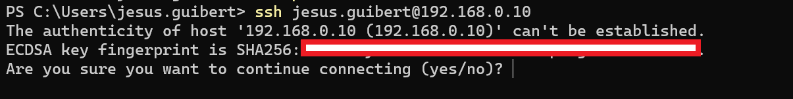
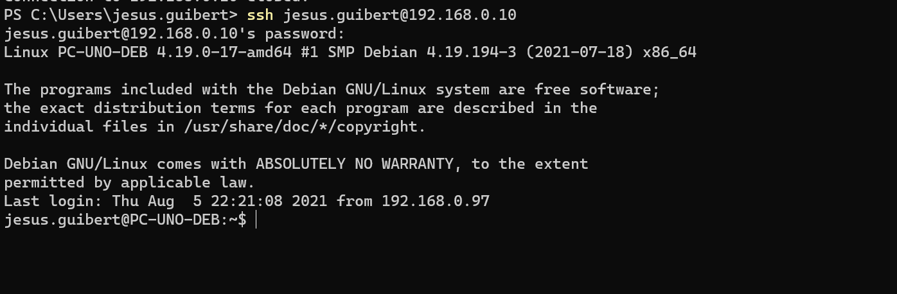
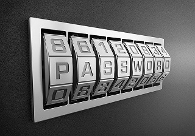

# Taller 1 - Introducción a los CLI

## Descripción

Finalizado el proceso de instalación ya tenemos dos Sistemas Operativos(SOs) al que llamaremos:
1. Debian 10: DEB
2. Windows 10: WIN

ambos instalado en el mismo equipo (maquina virtual), compartiendo el mismo disco y con un gestor de arranque dual.

En ambos sistemas operativos comenzaremos con la gestión desde la CLI (Command Line Interface), para ello la primera "configuración" a realizar sera la habilitación de uno de los servicios de terminal remoto mas utilizado SSH, específicamente la implementación OpenSSH.

Brevemente comentaremos que el servicio Servidor, al momento de ejecutarse por defecto comenzara a "escuchar" las peticiones de los clientes en el puerto número 22 del protocolo tcp. Por lo que es importante brindarle los permisos necesarios en caso de tener un servicio de firewall o implementado.

## Objetivos del taller

1. Configuración PortForwarding en nuestro hipervisor.
2. Conectar y loguearnos en nuestros SOs.
3. Ejecutar algunos comandos para ver el estado del SO(DEB).
4. Cambiar la contraseña del usuario(DEB).
5. Autenticarnos mediante un certificado RSA(DEB).

## 1. Configuración PortForwarding de nuestro hipervisor.

## 2. Conectar y loguearnos en nuestro SO.
El acceso a una CLI remota puede realizarse mediante el protocolo telnet, de hecho hace unas décadas era el estándar por defecto, su simpleza hace posible que el intercambio de comandos entre una sesión se realice muy fácilmente entre ambos nodos o equipos conectados en una red. El problema es que esa simpleza tiene el defecto de no implementar ningun mecanismo de cifrado, lo que hace muy fácil que esa sesión remota se pueda capturar para observar los datos que por ahí son trasmitidos.

Es por esto que es mas seguro utilizar el protocolo SSH.

Para conectarnos al servidor SSH utilizamos un cliente SSH, en la mayoría de sistemas operativos Linux o Unix, es muy probable que al iniciar una terminal e ingresando el comando ssh ya podemos comenzar a establecer una nueva sesión con un servidor.

En las últimas versiones de Windows 10 en la terminal ya se esta incorporando el cliente ssh (OpenSSH Client) pero en caso de no tenerlo podemos ejecutar un cliente de terminales llamado [Putty](https://www.putty.org/) o si tenemos habilitado [WSL](https://docs.microsoft.com/en-us/windows/wsl/install-win10)

    ssh user@<ip address> -p <portnumber>

Descripción:

1.user: usuario para autenticarnos.

2.ip address: Dirección Ip del servidor SSH.

3.portnumber: numero de puerto tcp donde esta escuchando el servidor.

Ejemplo:

    ssh jesus.guibert@192.168.0.10 -p 3000

>Primera conexión

>Ejemplo: Primera conexión

Si es la primera vez que nos conectamos a esa dirección IP, nos aparecerá una advertencia solicitando confirmación del fingerprint del servidor. De esta manera de almacenara en la cache específicamente en el archivo .ssh\known_hosts.

>Else: si no es la primera vez que nos conectamos a esa IP y el fingerprint del que tenemos almacenado en la cache no coincide con el fingerprint del servidor, estamos ante:
1. Estamos siendo engañados y estamos ingresando a un servidor diferente.
2. Podríamos ser victimas de un ataque MITM(Man in the Middle).

Una vez iniciado sesión correctamente, por lo general tenemos(si aun no lo personalizamos) el formato ***usuario@hostname ~ $*** :
1. usuario: nombre del usuario de esa sesión.
2. hostname: nombre del equipo en el que estamos conectado.
3. \~: indica que estamos en el directorio home del usuario.
4. \$: estamos con un usuario con privilegios normales. Si en lugar de $ aparece el signo #, entonces se estaria conectado como superusuario(root).

>Ejemplo: Primera conexión

## 3. Ejecutar algunos comandos y deduzcamos su funcionamiento.

### Ingreso de comandos

Para el ingreso de comandos, se escriben y se presiona la tecla Enter. Si el comando es válido se ejecuta, de lo contrario se informa con un mensaje de error.

Al igual que otros SO, se buscaran los comandos al querer ejecutar en los directorios indicados en la variable de entorno $PATH, pero existen comandos que no están almacenados en disco, sino que en todo momento están cargados en memoria. Estos son los comandos internos de la Shell. Ejemplo: ***cd,chdir,alias,set,export***

Los comandos pueden tener la siguiente sintaxis:

>comando opciones argumentos

Existen muchos atajos(estos son algunos) en la edición de los comandos que ingresamos en la Bash:

- Control + b : Mueve el cursor un carácter hacia atrás.
- Control + f : Mueve el cursor un carácter hacia adelante.
- Control + l : Limpia la pantalla.
- Control + c : Cancela el comando en ejecución actual.
- Alt + d : Elimina el texto desde donde está el cursor hasta el final de la palabra actual
- Ctrl + w : Elimina el texto desde donde esta el cursor hasta el inicio de la palabra actual
- Ctrl + a : Posiciona el cursor al inicio de la línea 
- Ctrl + e : Posiciona el cursor al final de la línea 

### Ejecutemos los comandos:

>ls

>uptime

>free

>df -h

>uname -a

>hostname

>arch

>id

>w

>echo $SHELL

>echo {con,pre}{tador,air}

## 4. Cambiar la contraseña del usuario.

Con el comando ***passwd*** podemos cambiar la contraseña del usuario actual y si tenemos los privilegios necesarios podemos pasar como argumento el nombre del usuario al que queremos realizar el cambio.

## 5. Autenticarnos mediante un certificado RSA(DEB)

Para evitar los riesgos de seguridad que trae ingresar la contraseña en cada nuevo ingreso remoto, se utiliza la autenticación mediante un certificado.

Para esta configuración la dividiremos en dos pasos:

1. Crear el certificado.
2. Copiarlo al usuario correspondiente en el servidor.

### Crear el certificado

El usuario genera un par de llaves con la máquina cliente con ***ssh-keyget -t rsa***.

La llave publica se almacena en ~/.ssh/id_rsa.pub 

La llave privada se almacena en ~/.ssh/id_rsa

Si no se protegió la llave privada con una “frase de contraseña” al momento de crearla, todos los inicios de sesión siguientes al servidor funcionarán sin contraseña.

### Copiarlo al usuario correspondiente en el servidor.

El usuario lo puede realizar mediante ***ssh-copy-id servidor*** para agregar su llave publica al archivo ~/.ssh/authorized_keys en el servidor. O editando el archivo anterior agregando la la llave publica generada anteriormente.

