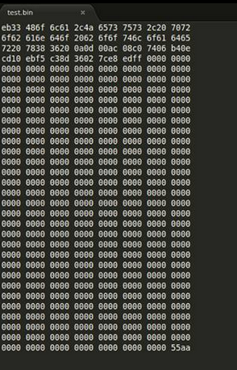

# Taller 2 - Bootloader x86

## Descripción

Finalizado el proceso POST (Power On Self Test), la BIOS busca (siguiendo el orden establecido) en su lista de medios de almacenamiento (data storage)  la presencia de un gestor de arranque (bootloader). Este reside en el conocido “primer sector” del data storage llamado MBR(Master Boot Record).

El proceso en que la BIOS determina si dentro del MBR se encuentra un bootloader es llamado Boot sector signature, el cual consiste en buscar al final del  primer sector (de tamaño 512 Bytes), la presencia de una secuencia hexadecimal (0x55 y 0xAA) .

Byte 510=0x55

Byte 511=0xAA

Si se detecta la presencia de la secuencia anterior, BIOS procederá a cargar el sector en memoria y comenzar la ejecución de las instrucciones que tenga el mismo.

Ejemplo de la visualización de un archivo binario donde podemos ver la secuencia:

## Objetivos del taller

1. Investigación de la arquitectura x86(set de registros, instrucciones, etc).
2. Entender el arranque de un computador con arquitectura x86
3. Introducción al entorno de desarrollo de un sistema operativo.
4. Introducción al hypervisor Qemu.

## 1. Modo real.

Es un modo de operación posterior al CPU 8086, caracterizado por utilizar 20bits de espacio de direcciones segmentadas. Esto nos permite direccionar hasta 1MB de memoria, acceso directo del software a las rutinas del BIOS y a hardware de E/S.

Es por eso que los bootloaders para la arquitectura x86, ejecutan pocas instrucciones en este modo: preparan el HW para cargar el kernel del SO. 

Ejemplo: leer una tabla de particiones.

>Iniciando bootloader (Ejemplo)

Se recomienda los siguientes conceptos de Arquitectura del Computador:

- [Lenguajes y compilación](https://www.youtube.com/watch?v=ts7JbRapkz4)
- [Programacion a bajo nivel - Ejercicio 1](https://www.youtube.com/watch?v=4G7O2xgwG0c)
- [x86 Parte 1](https://www.youtube.com/watch?v=2PyB2OE2qwY)
- [x86 Parte 2](https://www.youtube.com/watch?v=ytEWBum2454)

## 2. NASM

El Netwide Assembler o NASM, es un ensamblador libre para la plataforma Intel x86. Puede ser usado para escribir programas de 16-bit, 32-bit (IA-32) y 64-bit (x86-64). En el NASM, si se usan las bibliotecas correctas, los programas de 32 bits se pueden escribir de una manera tal para que sean portables entre cualquier sistema operativo x86 de 32 bits. El paquete también incluye un desensamblador, el NDISASM. 

Finalizado el proceso de descarga e instalación de NASM en nuestro equipo Hosts, se deberá de cargar la ruta absoluta de los binarios en la variable de entorno PATH. Para comenzar a utilizar los binarios desde una CLI.

>Contenido de la variable PATH en un HOST con Windows.
>Ejecución de nasm en la CLI

Ahora podemos generar nuestro código en ensamblador:

>Contenido de main.asm

    mov ah, 0x0e ; tty mode
    mov al, 'H'
    int 0x10
    mov al, 'o'
    int 0x10
    mov al, 'l'
    int 0x10
    mov al, 'a'
    int 0x10

    jmp $ ; loop infinito, saltamos a la dirección actual de memoria

    ; Numero magico y completamos el resto de bytes a 0
    times 510 - ($-$$) db 0
    dw 0xaa55 

y compilarlo:

>nasm -fbin main.asm -o main.bin

## 3. Qemu

QEMU es un emulador de procesadores basado en la traducción dinámica de binarios (conversión del código binario de la arquitectura fuente en código entendible por la arquitectura huésped). QEMU también tiene capacidades de virtualización dentro de un sistema operativo, ya sea GNU/Linux, Windows, o cualquiera de los sistemas operativos admitidos; de hecho es la forma más común de uso. Esta máquina virtual puede ejecutarse en cualquier tipo de Microprocesador o arquitectura (x86, x86-64, PowerPC, MIPS, SPARC, etc.). Está licenciado en parte con la LGPL y la GPL de GNU. 

***OFICIALMENTE EL PROGRAMA NO DISPONE DE UNA GUI***

Finalizado el proceso de descarga e instalación de QEMU en nuestro equipo Host, se deberá de cargar la ruta absoluta de los binarios en la variable de entorno PATH. Para comenzar a utilizar los binarios desde una CLI.

Ahora podremos iniciar el binario compilado anteriormente en una vm(virtual machine) con un cpu de arquitectura x86:
>qemu-system-x86_64 main.bin

Eje:

Qemu ejecutando nuestro binario compilado en NASM

## 4. Publique su trabajo

Llegado a este momento es una buena idea que publique su trabajo para mostrar su avance en el curso. Con alguanas capturas de sus sistemas duales en https://chat.jesusguibert.com/channel/SistOper

También puede utilizar el chat para consultas,dudas y realizar aportes relacionado a la asignatura.